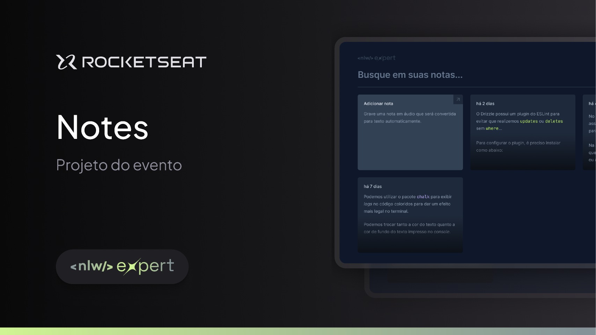

# NLW Expert Notes

Projeto orientado pela Rocketseat



---
| [Link Notion](https://efficient-sloth-d85.notion.site/NLW-14-Expert-9e11ff472de64b08a5f9e277a20c3ecc) | [Link Figma](https://www.figma.com/community/file/1336456128647909148/nlw-expert-notes) |

---

## Instalando o Vite

```sh
npm create vite@latest
```

## Instalando o Tailwindcss

```sh
npm install -D tailwindcss postcss autoprefixer
npx tailwindcss init -p
```
